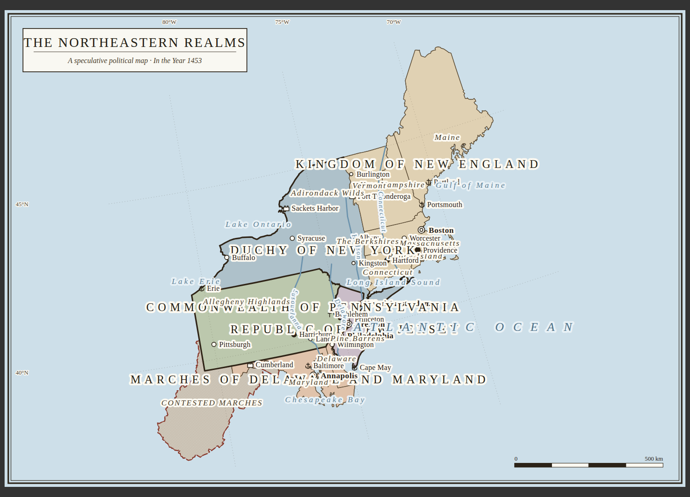
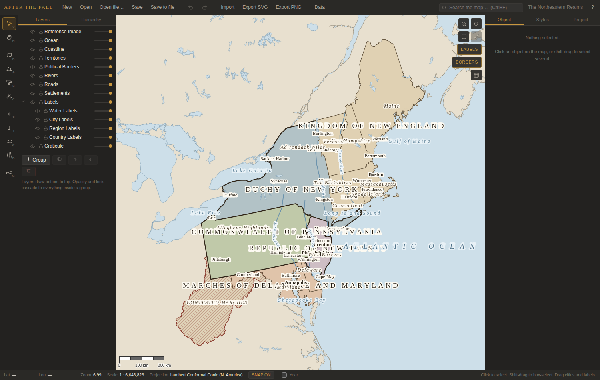

# After the Fall

An interactive editor for **historical, political and alternate-history maps** — the kind of thing
you find in a printed historical atlas, not a video-game strategy map. It runs entirely in the
browser, needs no server, and is structured so it can be packaged with Tauri later.



*The bundled demonstration map, exported to SVG at 3000 × 2100. Everything in it — territories,
hierarchy tints, border weights, hatching, city symbols, tracked country names, river labels
following the river, graticule, frame, title block and scale bar — is produced by the editor.*



*The editor on first launch: the realms of the post-apocalyptic Americas, with the tool palette,
layer/hierarchy tree, map and object inspector. Every realm is an ordinary territory, arranged in an
empire → vassal hierarchy and editable like anything you draw.*

---

## Running it

```bash
npm install
npm run dev          # http://localhost:5173
```

```bash
npm run build        # typecheck + production bundle into dist/
npm run test         # 160 unit tests over the geometry, history, export and map data
npm run typecheck    # tsc, no emit
```

The first launch loads the **After the End** map — a political atlas of the post-apocalyptic
Americas of the Crusader Kings total conversion — so the feature set is visible immediately on a
real subject. **New** starts a blank map, one seeded with real geography, or the smaller
north-eastern demonstration map.

Thirty sovereign realms and about a hundred and fifty vassals span both continents, built by the
same public API the UI uses: territories arranged into the empire → vassal hierarchy, given the
border tiers, and labelled by the ordinary label engine.

**The shapes are grown, not traced.** A collapsed world that still divides at the state line is not a
collapsed world, and no amount of dissolving modern subdivisions can produce the look of a realm
spreading from a city until it meets a rival. `geo/realmGrowth.ts` rasterises the coastline to a
20 km lattice and lets each realm claim outward from its seat, paying a price per cell that decides
what the map looks like:

* **fractal noise**, standing in for terrain nobody has modelled — ridges of expensive ground that
  both neighbours stop at. This is the part that matters. White noise per cell averages out over
  distance, so a frontier perturbed by it still lands on the straight bisector between two seats, and
  the first version of this produced a field of hexagons. Noise correlated across tens of cells makes
  whole stretches of frontier bulge one way, which is what a real border does.
* **rivers cost extra to cross**, so borders settle onto them as real ones do.
* **coasts are cheap**, so a realm runs along a shoreline far faster than it pushes inland — the
  origin of every long thin coastal state on a real map.

Area scales with the *square* of a realm's strength, so a few powers sprawl among many small ones
instead of every realm coming out the same size, and each stops once it has taken what its strength
allows, which is what leaves genuine wilderness between them.

Turning the lattice back into outlines is where shared borders are won or lost. Simplifying each
realm's ring on its own pulls every neighbour apart, because Douglas–Peucker keeps different vertices
depending on where in the ring it starts — the map grows a white seam along every frontier. So each
ring is cut into arcs at the junctions where three regions meet, and each arc is simplified and
rounded once with its endpoints pinned. Both simplification and corner-cutting give the same answer
on a reversed polyline, so the two realms either side of an arc agree on it exactly — down to the
tie-break, because a traced frontier is a staircase on which points tie constantly for "farthest from
the chord", and keeping whichever was found first is an answer that depends on which end you started
from. Ties go to the lexicographically smaller point, which does not.

**A realm ends where the land does.** The lattice claims whole cells, so a coastal realm's outline
runs up to half a cell — twenty kilometres — out to sea, and rounding it off pushes it further: a
smooth blob lying across a coastline drawn at a thousand times its resolution. Each realm is
therefore trimmed to the coast once it has grown, and its sea-facing edge is then the shoreline
itself, at full 1:10m detail, bay for bay. Only the sea-facing edge changes; an inland frontier lies
strictly inside the land, so the trim finds nothing to cut and neighbours still agree vertex for
vertex.

Trimming two hundred realms against a continent is the one part of this that had to be made fast.
Natural Earth's Americas are 1,448 parts and 164,000 vertices, but two thirds of that is a single
ring running from the Beaufort Sea to Cape Horn, and clipping against it costs two seconds however
small the realm — six minutes for the map. So the large parts are diced on a coarse grid once, up
front; the cuts run through the interior of the land and the pieces abut exactly, so their union is
the original coastline to the last vertex. A realm then meets a handful of pieces of a few thousand
vertices each and the trim costs milliseconds. The whole New World grows, trims and draws in about
twelve seconds, and the same inputs always give the same map.

Realm names, their tier and the empire each belongs to come from the setting's own realm list; where
each sits is an informed placement, not a tracing of the mod's province map, which is not published
as geodata. Treat every border as a starting point to redraw, which is the whole point of the
application. Vassal and capital names start hidden — a hundred and fifty of them under thirty empire
names is a mat rather than a map — and the Region and City Labels layers turn them on.

Reference geography ships in `public/data/` and is fetched lazily — only the datasets you switch on
are ever loaded, and nothing is downloaded from the internet at runtime.

| Dataset | Coverage | Size |
|---|---|---|
| World coastlines | Global | 2.9 MB |
| Country boundaries | Global | 3.5 MB |
| Lakes | Global | 1.2 MB |
| Rivers | Global | 2.0 MB |
| Cities & towns | Global | 1.4 MB |
| Provinces & states | The Americas | 1.4 MB |
| US states / counties (Census) | United States | 110 / 820 KB |

**One scale, and it is the good one.** Each of these used to ship in three editions — 1:110m,
1:50m and 1:10m — which put three entries in the layer list for every kind of geography and asked a
question nobody wanted to answer. Only Natural Earth's finest published scale remains: roughly
seven times the vertex density of 1:50m, a few megabytes more, and no choice to make. Projects saved
against a coarser edition are repointed at the detailed one when they load.

The subdivisions are cropped rather than coarsened, on the same logic: the world's provinces at
1:10m is 4,596 features and close to 5 MB, too much to bundle for a map of one hemisphere, so the
file covers the Americas. It is what makes a realm buildable out of real administrative units
outside the United States, which is the only place the Census files cover.

**Most maps are about somewhere, not everywhere.** Project → Map area crops the map to a region:
reference geography outside it is never projected or drawn, and the view cannot pan or zoom past it,
so a map of the Americas behaves like a sheet of paper of a definite size rather than a window onto
the globe that happens to be pointed at Brazil. A new map comes cropped to the western hemisphere;
**Crop to current view** and **Whole world** set it by hand at any time. Cropping bounds the reference data and
the view, never the document — anything you have drawn outside it stays put, stays editable and still
exports.

Cropping is what makes the antimeridian matter. Afro-Eurasia is a single part of Natural Earth's
1:10m land file whose ring steps from +180° to −180°, so its bounding box is the entire globe and
every window on Earth "overlaps" it — which is how the whole of Eurasia turns up in a map of the
Americas. Parts that wrap are therefore tested vertex by vertex instead, parts that straddle the edge
are genuinely cut to it, and parts fully inside are passed through untouched.

Reference geography is clipped to the projection's **domain of validity** before it is drawn, per
polygon part rather than per feature. This matters more than it sounds: Natural Earth ships all land
as a single feature holding a MultiPolygon of four thousand landmasses, and in a conic projection
centred on 39°N, Antarctica projects to a ring 66,000 km across — filling the entire canvas with
land colour and hiding the ocean completely. Testing the feature's own bounding box cannot catch
that, because the feature spans the world.

**Lakes render over the political fills, rivers over those** — a lake inside a country has to be
drawn on top of its colour or it disappears underneath, which is both how atlases set water and the
only way the layer is usable for tracing. Lakes convert into water-styled territories and rivers
into editable river features, so reference water can become part of the document in one step.

Rivers are weighted by Natural Earth's `scalerank` on screen and in the export, so trunk rivers
carry the eye and tributaries stay quiet rather than every watercourse drawing as the same hairline.
Converted rivers keep that ranking (major rivers get the heavier line style) and their names run
along the river itself via text-on-path.

**Cities and towns** draw as quiet hollow dots with grey names, below the map's own settlements, so
real places read as a backdrop you are placing your own against rather than competing with them.
Both the dots and the names thin out as you zoom out — 7,300 of either is a stipple, not a map — with
dots surviving a few ranks longer than names, so a city appears as a mark first and earns its name
further in. The layer is decluttered, so a name is dropped rather than overprinted. The screen and the SVG exporter
ask the same function which names survive at a given scale, so a printed map names the cities the
editor showed. Converting them makes each one an editable settlement: Natural Earth marks national
and regional capitals, so each arrives with the right symbol, and population, country and region
come across with it.

**The legend writes itself** (§26). Its rows come from what the map actually contains — the
settlement types it uses, the border tiers its territories carry, the water it draws — so a map with
no fortresses has no fortress in its key, and a map that gains a disputed border gains the hatching
row without anyone remembering to add it. Each row names a *style class* rather than carrying its own
appearance, so every swatch is drawn by the same code that draws the map: restyle the sovereign
border and the key's rule changes with it. Renaming, hiding or reordering a row hands control over,
and one button hands it back. A compass rose (§28) sits alongside it, in one of three drawn styles.
Both go into the exported SVG in their §66 groups.

For anything finer than 1:10m — a single bay, an estuary, a city shoreline — import your own:
[GSHHG](https://www.soest.hawaii.edu/pwessel/gshhg/) has full-resolution global coastlines, and an
OSM extract clipped to your area works too. Both come in as GeoJSON through **Import**.

The lake, river, city and subdivision files are built by `node scripts/build-basemaps.mjs`, which
fetches Natural Earth, drops its ~60 localised name fields per feature and converts to quantized
TopoJSON (a 3–28× reduction depending on the file). The output is committed, so a clone needs no
network.

### Deploying to GitHub Pages

`.github/workflows/pages.yml` typechecks, tests, builds and publishes on every push to the default
branch, and can also be run by hand from the Actions tab. It needs Pages switched on once, by a repo
admin: **Settings ▸ Pages ▸ Build and deployment ▸ Source: GitHub Actions**.

**That source setting is load-bearing, and it is not optional here.** With the source left on
"Deploy from a branch", GitHub also runs its Jekyll builder, which publishes the branch root — the
unbuilt `index.html` that asks for `/src/main.tsx`, and none of the bundled geography, which lives
under `public/`. Both deployments target the same site and the last to finish wins, with no failing
workflow to show for it.

The workflow passes `enablement: true` to `configure-pages`, which is the documented way to set the
source from CI, but on this repository it does not take effect: the Jekyll run still appears for
every push and still publishes the root. Measured timings — Jekyll about 50 s, this workflow 45 s
warm and a little over two minutes cold — make which one lands last a coin flip, and the site has
flipped to the raw repository more than once. The deploy job therefore waits two minutes before
publishing, which makes it deterministic at the cost of a slower deploy.

**Set the source to GitHub Actions in the repository settings** and the whole thing goes away: the
Jekyll run stops, the race stops, and the `sleep` in the deploy job can be deleted. Until then, note
that a failure in this workflow leaves the raw repository live.

Pages serves from a sub-path (`/<repo>/`), which is why `vite.config.ts` sets `base: './'` and the
bundled geography is fetched with document-relative URLs. Both are load-bearing — changing either to
an absolute path will break a sub-path deployment.

---

## What the recurring cartographic elements are, and where each one lives

The spec's visual target (§59) decomposes into a handful of recurring elements. This is how each is
handled:

| Element | Implementation |
|---|---|
| Pastel political fills | `TerritoryStyle.fillColor` + the palette generator (`geo/palette.ts`) |
| Thin internal boundaries, heavy sovereign ones | Borders are **derived**, not drawn — `render/borders.ts` |
| Detailed coastline geometry | Natural Earth 1:10m and US Census data, convertible to editable territories |
| Lakes and rivers | Natural Earth water at 1:10m, drawn over the political fills |
| Real city locations | Natural Earth populated places at 1:10m, convertible to settlements |
| Widely-spaced country names | Per-glyph text rendering with real tracking — `render/textRenderer.ts` |
| Sea labels on broad curves, river labels along rivers | Text-on-path, same module |
| City circles, larger capital symbols | `render/symbols.ts`, one definition drawn to canvas *and* SVG |
| Disputed-territory hatching | `render/patterns.ts`, one definition → `CanvasPattern` *and* `<pattern>` |
| Latitude/longitude grid, frame, title, scale bar | `export/svgExport.ts` and the OpenLayers graticule layer |
| Legend and compass rose | `export/legend.ts` — rows derived from the map, swatches from its style classes |
| A map that is about a region, not the globe | `workingExtent` crops the reference data and bounds the view |
| A whole political world that is not a modern one | `geo/realmGrowth.ts` grows realms from seats; `demo/afterTheEnd.ts` names them |
| Large maps suitable for print | Export up to 12000 × 8000 raster, unbounded vector |

---

## Architecture

The spec's §60 requirement — separate geographic data from cartographic appearance from UI state —
is the organising principle of the whole codebase, not a note in a comment.

```
GEOGRAPHIC DATA          CARTOGRAPHIC APPEARANCE        UI STATE
src/model/types.ts       src/model/defaults.ts          src/state/uiStore.ts
  Territory                StyleSheet                     tool, selection, hover
  Settlement               TerritoryStyle                 snap settings
  LinearFeature            LineStyle / TextStyle           dialogs, toasts
  MapLabel                 SymbolStyle / HatchPattern
  geometry: GeoJSON        referenced by id,            never serialised
  always WGS84             overridable per object       into a project file
```

A `Territory` stores *where it is* and *what it is*. It stores no colours — only a `styleClassId`
and a sparse `styleOverrides` patch. Change the "Country Border" style class and every border using
it changes, which is what keeps a map with a thousand features consistent (§40).

### Directory structure

```
src/
  model/            The document. Pure data, no rendering, no OpenLayers.
    types.ts          Every interface in §61. The single source of truth.
    defaults.ts       Built-in style classes, border hierarchy, palettes.
    project.ts        Project construction, default layer stack, schema migration.
    hierarchy.ts      Territory and layer tree traversal (flat storage → tree views).
    resolveStyle.ts   styleClass + overrides + parent inheritance → final appearance.
    color.ts          Colour maths: shading, perceptual distance, contrast.
    timeline.ts       Year-range filtering.
    ids.ts

  geo/              Geometry. Turf-backed, no UI.
    operations.ts     union / difference / intersect / dissolve / split / simplify.
    topology.ts       The shared-border system. See below.
    projections.ts    Projection catalogue and registration.
    winkelTripel.ts   Winkel Tripel + Natural Earth (proj4 ships neither).
    palette.ts        Graph-colouring palette generator.
    basemap.ts        Reference geography loading.

  state/            Zustand stores and the command layer.
    history.ts        Patch-based undo/redo. Every write goes through `Recorder`.
    projectStore.ts   The document + undo stacks + feature factories.
    uiStore.ts        Session state. Never saved.
    commands.ts       Every user-facing operation, in exactly one place.

  render/           Document → pixels.
    MapController.ts  Owns the OpenLayers map. Diffs the store by object identity.
    borders.ts        Derives border lines from territory adjacency.
    olStyles.ts       Resolved style → cached OpenLayers Style.
    textRenderer.ts   Per-glyph text: tracking, halo, text-on-path, collision boxes.
    symbols.ts        Settlement symbols as primitives → canvas and SVG.
    patterns.ts       Hatch fills → CanvasPattern and <pattern>.

  tools/
    ToolManager.ts    All OpenLayers interactions, swapped by active tool.

  export/
    svgExport.ts      A real vector serialiser. Text stays text.
    pngExport.ts      Rasterises the SVG, so PNG and SVG always agree.

  io/importers.ts     GeoJSON / TopoJSON / KML / GPX / CSV, and basemap → territory.
  persistence/        Dexie storage, autosave, .atfmap file format.
  components/         React UI. Never in the map's render path.
  demo/               The demonstration map. Test data only.
```

### Why React never renders the map

§51 asks that moving one vertex must not re-render the application. It doesn't:

* React mounts `MapController` once and renders only chrome — toolbar, panels, dialogs.
* The controller subscribes to the store directly and **diffs by object identity**. Because an edit
  produces new objects only for the records it touched, syncing a one-vertex change touches exactly
  one OpenLayers feature out of however many exist.
* Styles are cached on their resolved appearance, so the per-frame style function is a map lookup.
* During a vertex drag, OpenLayers owns the frame; the store is written once, on `modifyend`.

---

## The shared-border system (§6)

This is the feature the spec calls "extremely important", and it deserves an explanation of what was
built and why.

There are two ways to guarantee adjacent territories never develop gaps or overlaps:

**(a) Store a true planar graph** — nodes, edges, and faces referencing directed edge rings.
Topologically airtight by construction. But then every import, export, boolean operation and undo
patch has to go through the graph, GeoJSON round-trips stop being trivial, and the project file
stops being something you can read.

**(b) Store ordinary polygons and actively maintain the invariant.**

This implements **(b)**, through three mechanisms in `geo/topology.ts`:

1. **Snapping** (`snapPosition`, plus OpenLayers' `Snap` on every drawing tool). New and dragged
   vertices latch onto existing vertices and edges, so a shared boundary starts out *genuinely*
   coincident — the same coordinates in both polygons, not merely close.

2. **Propagation** (`propagateVertexEdit`) — the part that makes a border behave as one border.
   When a territory's geometry changes, the before and after are diffed to find which vertices
   moved, and every neighbour holding a vertex at one of those positions is moved with it, in the
   same undo command. Move the border between Kingdom A and Kingdom B and both polygons update.

   Vertices are matched by index rather than by value, which is exact for dragging one vertex,
   dragging several, and translating a whole polygon. If the edit *inserted or deleted* a vertex the
   correspondence is genuinely ambiguous, so `diffVertexMoves` returns `null` and propagation is
   skipped rather than guessing and corrupting a neighbour.

3. **Validation and repair** (`validateTopology`, `repairTopology`) for whatever slips through.
   Repair runs three passes, ordered so each makes the next easier:
   * **weld** near-coincident vertices onto one shared position — this removes the *cause* of most
     slivers rather than the symptom;
   * **subtract overlaps** from whichever territory is smaller;
   * **fill sliver gaps** into whichever neighbour surrounds most of the gap.

   A parent territory legitimately covers its own subdivisions, so ancestor/descendant pairs are
   excluded from overlap checks — otherwise every hierarchical map would report false errors.
   Anything larger than the sliver limit is reported but never silently changed, and the tool says
   so rather than claiming all is well. Locked territories are never touched. The whole repair is
   one undo step.

The API is deliberately shaped so a future move to design (a) could sit behind it unchanged.

### Derived borders (§8, §57)

Territories store **areas**. The lines between them are computed in `render/borders.ts`: every
boundary segment is classified by looking at who is on each side.

* Both sides under the same sovereign → the *finer* of the two border weights (an internal hairline).
* Different sovereigns → the *heavier* weight (a sovereign border).
* Nobody on the other side → that territory's own weight (its coast or outer frontier).

That single rule is what §57 asks for: assign counties to states with the paint tool, and the
national borders appear and disappear on their own. Segments are hashed on their endpoints, so
exactly-shared edges — the ones snapping and welding produce — match in constant time, and the
result is memoised on the territory set so panning never recomputes it.

---

## The territory paint system (§55, §56)

The intended workflow for an alternate-history map of somewhere real:

1. **Project ▸ Reference geography ▸ Convert to territories…** Pick a dataset (US counties, say),
   filter it to a state or a name list, and import one editable `Territory` per feature.
2. Draw or import the state you want to build, then switch to the **Paint** tool (`B`) and choose it
   in the Inspector.
3. Drag across subdivisions on the map. Each one gets `parentId` set to the target, its border
   demoted to county weight, and the parent's own outline grown to the union of everything assigned
   to it. One undo entry per stroke, not per county.
4. The border hierarchy does the rest: internal boundaries fade to hairlines, and a sovereign border
   appears wherever differently-assigned subdivisions touch.

The same dissolve machinery backs **Create Territory from Selection**: select several divisions,
and they become one new state with their internal borders erased, preserved underneath as
subordinate divisions with inherited colour.

---

## SVG export (§48, §66)

`export/svgExport.ts` is a real vector serialiser, not a canvas dump.

* Polygons, borders and symbols are written as `<path>`, `<circle>`, `<polygon>`.
* **Text stays text** — `<text>` and `<tspan>`, never outlined, never rasterised.
* Tracking becomes `letter-spacing`; halos become `paint-order="stroke"`; text-on-path becomes a
  real `<textPath>`.
* Hatch fills become `<pattern>` defs generated from the *same* description the canvas renderer
  uses, so what exports is what you were looking at.
* Groups are emitted in exactly the order §66 specifies, so the file opens in Illustrator or
  Inkscape with a sane layer structure:

```
water · terrain · territories · internal-borders · international-borders ·
rivers · roads · settlements · labels · graticule · legend · frame
```

Territory groups carry `data-name` and `data-type` attributes, so an exported map is still
identifiable after it leaves the app.

**PNG export rasterises that same SVG** rather than screenshotting the live map — one renderer, one
result, and output sizes bounded only by what a browser canvas will hold (very large images are
drawn in bands so peak memory is one band, not the whole picture).

---

## Projections (§4)

Geometry is always stored in WGS84. A projection is purely a *view* concern, so switching one
re-projects on the fly and never touches stored coordinates.

Mercator · Equirectangular · Robinson · **Winkel Tripel** · **Natural Earth** · Mollweide ·
Lambert Conformal Conic · Albers Equal Area · Orthographic · plus any custom proj4 string.

proj4js ships neither Winkel Tripel nor Natural Earth, so both are implemented in
`geo/winkelTripel.ts` against proj4's documented extension contract. Neither has a closed-form
inverse: Winkel Tripel is inverted by two-dimensional Newton–Raphson, Natural Earth by a scalar
Newton iteration on its polynomial. `winkelTripel.test.ts` round-trips a grid of control points
through both to prove the inverses are right.

---

## Undo/redo (§36)

Snapshotting the document per edit is simple but wasteful — a 2,000-polygon map is megabytes, and
the spec asks for at least 100 states. Instead every edit records a **patch**: the before and after
value of each record it touched. Undo replays `before`, redo replays `after`. Nudging one vertex
costs one polygon, not one map.

Every mutation funnels through `Recorder`; there is deliberately no other way to write to the
document, which is what makes undo complete rather than merely mostly-complete. Selection is
captured with each command, so undo restores what you had selected. The stack holds 200 states.

---

## Project format (§49, §50)

`.atfmap` files are the `MapProject` object in a small envelope — plain JSON, GeoJSON geometry,
string ids. Nothing is a rendered pixel, so a saved map is always fully editable. `migrate()`
upgrades older files additively and re-seeds any built-in style a file predates; a file from a newer
schema is refused with an explanation rather than silently mangled.

Maps are also autosaved into IndexedDB every 20 seconds, with rolling recovery snapshots written
periodically and before any load that would replace unsaved work.

---

## Current state

Phase 1 is complete, and the parts of Phases 2–4 that the priority list in §67 puts near the top
are in as well. Everything listed here works — there are no placeholder controls in the UI.

**Editing** — territory drawing, vertex editing with add/remove, merge, subtract, split-with-a-line,
dissolve-from-selection, the paint tool, duplicate, lock, hide, delete, box-select, multi-select,
bulk edit, context menus, 200-state undo.

**Topology** — snapping, shared-vertex propagation, gap/overlap/sliver detection with a preview
list, three-pass repair, simplify, smooth, remove-tiny-polygons.

**Structure** — unlimited territory hierarchy with colour inheritance, nested layer groups with
visibility/lock/opacity/reorder/rename/duplicate/delete, named style classes with per-object
overrides.

**Cartography** — border hierarchy with derived borders, hatch patterns, the palette generator,
settlements with ten symbol types, rivers and roads, labels with real tracking, halos, rotation,
manual placement and text-on-path, graticule, frames, title block, scale bar.

**Data** — real world/US geography including lakes, rivers and cities, GeoJSON/TopoJSON/KML/GPX/CSV import,
basemap→territory conversion, reference-image tracing, spreadsheet data table, search,
GeoJSON/CSV/SVG/PNG export, IndexedDB storage with autosave and recovery snapshots.

**Timeline** — start/end years on every feature, and the slider filters territories, subdivisions,
borders, settlements, lines and labels on both the screen and the export.

### Not built yet

Stated plainly rather than stubbed out:

* **Legend creator (§26)** — the SVG export emits an empty `<g id="legend">` so the structure is
  there, but there is no legend editor.
* **Compass rose (§28)** and **coordinate index (§29)**.
* **Terrain (§18)** beyond importing polygons as territories — no mountain symbols or hillshading.
* **PDF export (§48)** — SVG into a print pipeline is the current answer.
* **Masking/clipping (§46)** and **border labels (§44)**.
* **Shapefile import** — GeoJSON, TopoJSON, KML, GPX and CSV are supported instead.
* **Label collision** — the detection primitives exist (`findCollisions`, per-label boxes and an
  opt-out flag), but they are not yet surfaced as warnings in the UI.
* Reference images are a session aid and are not written into the project file.

---

## Tests (§64)

101 tests covering the parts where a silent regression would be expensive:

* `geo/operations.test.ts` — union, difference, intersection, dissolve, polygon splitting along
  straight and bent lines, simplification, interior-point placement for concave shapes.
* `geo/topology.test.ts` — vertex diffing, shared-border propagation (including that unrelated and
  locked neighbours are left alone), snapping, gap/overlap detection, hierarchy exclusion, all three
  repair passes, derived borders and segment merging.
* `state/history.test.ts` — patch recording, undo/redo round-trips, reverse replay of multiple
  writes to one record, redo-stack invalidation, 100+ history states, save/load round-trip, schema
  migration and version refusal.
* `export/svgExport.test.ts` — group presence and ordering, text staying text, tracking and halo
  attributes, pattern defs, border classification, symbol shapes, graticule, frame, title, style
  scaling, XML escaping, timeline filtering.
* `geo/winkelTripel.test.ts` — forward/inverse round-trips for all four numerically-inverted
  projections, plus the symmetry and pseudocylindrical properties each one should have.
* `geo/basemap.test.ts` — area/line discrimination for the water datasets, dataset registration, the
  state-name lookup, and per-part clipping to a projection's domain of validity.

---

## Licence and data

Application code is unlicensed pending a decision. The bundled geography is public domain:
[Natural Earth](https://www.naturalearthdata.com/) via `world-atlas`, and US Census cartographic
boundaries via `us-atlas`, both redistributed under their original terms.
